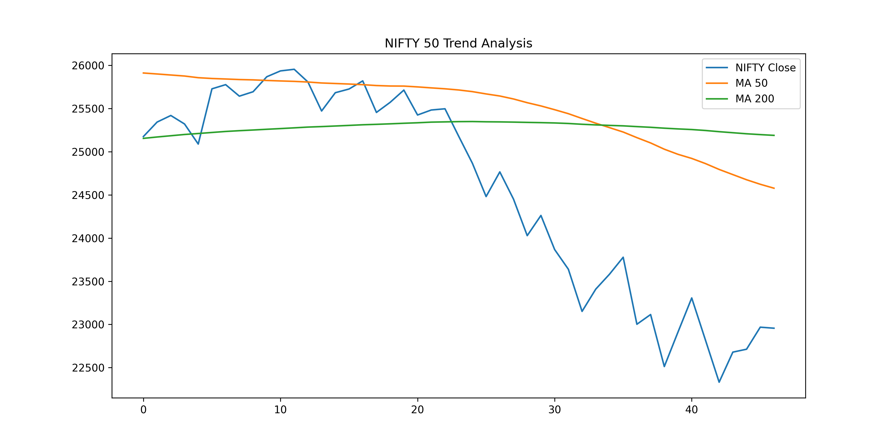
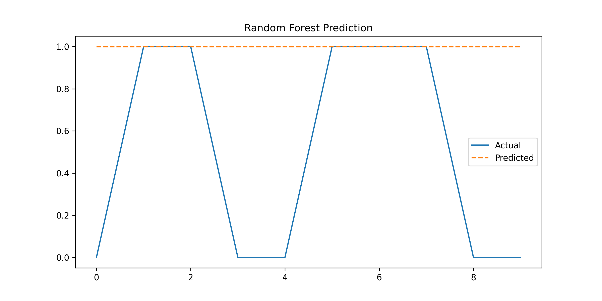

# 📊 Stock Market Analysis using Python

## 📌 Overview
This project analyzes NIFTY 50 stock data using Python to identify trends, volatility, and patterns.

## 🎯 Objectives
- Analyze stock price movements
- Calculate moving averages (MA50, MA200)
- Understand market trends and volatility

## 🛠️ Tools & Technologies
- Python
- Pandas
- NumPy
- Matplotlib

## 📂 Dataset
- Data collected using yfinance API
- NIFTY 50 index data (1 year, daily interval)

## 🔍 Key Analysis
- Data cleaning and preprocessing
- Moving averages (50-day & 200-day)
- Daily returns calculation
- Volatility analysis

## 📊 Visualization

## 🤖 Random Forest Prediction

## 💡 Key Insights
- Downtrend observed in recent period
- Moving averages indicate bearish signals
- Volatility increased during declining phase

## 🚀 Future Improvements
- Add predictive modeling
- Use multiple stocks comparison

  
#imported dataset of nifty 50 from yfinance
import yfinance as yf
df = yf.download("^NSEI", period="1y", interval="1d")
